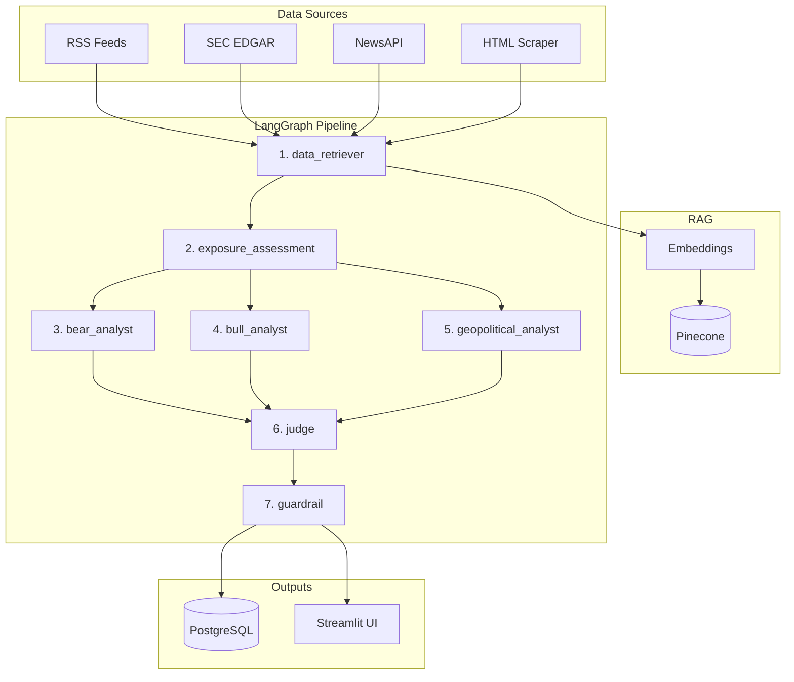

<div align="center">

# Supply Chain Risk Monitor

**Seven-agent LangGraph pipeline that ingests news, SEC filings, and web content — assesses company-level exposure — then debates risk from bear, bull, and geopolitical angles before delivering a structured, scored verdict.**

[](https://www.python.org/)
[](https://streamlit.io/)
[](https://github.com/langchain-ai/langgraph)
[](LICENSE)

**Live app:** https://supply-chain-risk-211330169092.us-central1.run.app

[Features](#features) · [Architecture](#architecture) · [Quick start](#quick-start) · [Evaluation](#evaluation) · [Challenges](#challenges--limitations) · [Security](#security--secrets) · [License](#license)

</div>

---

## Features

| | |
| --- | --- |
| **Seven-agent pipeline** | Retrieve → Exposure Assessment → parallel analysts (bear · bull · geopolitical) → judge → guardrail |
| **Company-level exposure** | Reads SEC EDGAR filings to assess how directly a company is exposed to a specific risk (Critical → Minimal). Scales the final score accordingly. |
| **Multi-source retrieval** | NewsAPI, RSS (Reuters / FreightWaves / SupplyChainDive), HTML scraper (Wikipedia / SupplyChainDive / LogisticsMgmt), SEC EDGAR |
| **RAG** | Pinecone + OpenAI `text-embedding-3-small` — docs chunked, embedded, and queried per run |
| **Structured output** | Judge returns JSON with **raw risk score 0–100**, multiplied by exposure scalar → **final score**; risk label and recommended action recalculated |
| **GuardRail** | Per-agent trust scores + hallucination flags + overall confidence band |
| **Streamlit UI** | Three pages: Search (Quick Scenarios, Guided Builder, Custom), Results (exposure card + verdict + analyst tabs + sources), GuardRail |
| **Persistence** | PostgreSQL (Docker or Cloud SQL) — optional; app degrades gracefully without it |

---

## Architecture

### System Architecture


### Data Flow Diagram


### Pipeline Detail


**Pipeline order:**
1. `data_retriever` — fetches and dedupes docs from all sources, upserts to Pinecone
2. `exposure_assessment` — reads docs (prioritising EDGAR) to assign exposure level and multiplier
3. `bear_analyst` / `bull_analyst` / `geopolitical_analyst` — parallel LLM calls, each receives exposure context
4. `judge` — synthesises debate → `raw_risk_score × exposure_multiplier = final_score`, recalculates label and action
5. `guardrail` — estimates per-agent trust scores and flags potential hallucinations

---

## Quick start

### 1. Clone & environment

```bash
git clone https://github.com/HrishiPal21/supply-chain-risk-monitor.git
cd supply-chain-risk-monitor
cp .env.example .env
```

Fill **at minimum** in `.env`:

| Key | Where to get it |
| --- | --- |
| `OPENAI_API_KEY` | platform.openai.com |
| `PINECONE_API_KEY` · `PINECONE_INDEX_NAME` · `PINECONE_ENVIRONMENT` | app.pinecone.io |
| `NEWS_API_KEY` | newsapi.org |

### 2. Python (local, no Docker)

```bash
python3 -m venv .venv
source .venv/bin/activate
pip install -r requirements.txt
python3 -m streamlit run app.py --server.port 8502
```

Open **`http://localhost:8502`**. The app runs without PostgreSQL — history features are disabled but all pipeline functionality works.

### 3. Docker Compose (app + Postgres)

```bash
docker compose up --build
```

Open **`http://localhost:8080`**. Postgres 16 initialises from `db/schema.sql` on first start.

### 4. Smoke test

```bash
python3 smoke_test.py
```

Runs a full end-to-end pipeline query (semiconductor/Taiwan, no ticker) and asserts all 20+ fields are present and sane. Exits 0 on pass, 1 on failure.

---

## Project layout

```
supply-chain-risk-monitor/
├── app.py                          # Streamlit entry point
├── config.py                       # Env vars, OpenAI client factory
├── smoke_test.py                   # End-to-end integration test
├── pages/
│   ├── 1_Search.py                 # Quick Scenarios · Guided Builder · Custom Query
│   ├── 2_Results.py                # Exposure card · verdict · analyst tabs · sources
│   └── 3_GuardRail.py              # Trust scores · hallucination flags
├── agents/
│   ├── graph.py                    # LangGraph wiring + run_pipeline()
│   ├── state.py                    # AgentState TypedDict
│   └── nodes/
│       ├── data_retriever.py
│       ├── exposure_assessment.py
│       ├── bear_analyst.py
│       ├── bull_analyst.py
│       ├── geopolitical_analyst.py
│       ├── judge.py
│       └── guardrail.py
├── tools/
│   ├── news.py                     # NewsAPI
│   ├── rss_feed.py                 # RSS (Reuters, FreightWaves, SupplyChainDive, …)
│   ├── edgar.py                    # SEC EDGAR full-text search + filing fetch
│   ├── html_scraper.py             # BeautifulSoup scraper (Wikipedia, SupplyChainDive, …)
│   ├── pinecone_client.py          # Pinecone index client (cached singleton)
│   ├── postgres_db.py              # DB helpers — graceful no-op when DB offline
│   ├── gcs_client.py               # GCS raw artifact upload (optional)
│   └── retry.py                    # Exponential backoff for OpenAI calls
├── db/schema.sql
├── Dockerfile
├── docker-compose.yml
└── .github/workflows/deploy.yml    # GCR → Cloud Run CI/CD
```

---

## Evaluation

### What was tested

| Test | Method | Result |
| --- | --- | --- |
| Full pipeline — semiconductor/Taiwan, no ticker | `smoke_test.py` (20+ field assertions) | All checks pass |
| Exposure Assessment — AAPL ticker | Manual run | Critical (1.0×) — EDGAR confirms heavy Taiwan/TSMC dependency |
| Exposure Assessment — MCD ticker | Manual run | Minimal (0.1×) — McDonald's has no semiconductor supply chain |
| Partial context (some sources fail) | Induced source failure | `partial_context=True` flag surfaced in UI; pipeline completes |
| HTML scraper | Manual run | Wikipedia ✅  SupplyChainDive ✅  LogisticsMgmt ✅ |
| DB offline | Ran without Docker | App starts and pipeline runs; history disabled gracefully |

### Output quality observations

- **Exposure multiplier** meaningfully differentiates risk. AAPL (Critical, 1.0×) receives full raw score; MCD (Minimal, 0.1×) receives 10% of raw score for the same Taiwan semiconductor query — which matches real-world exposure.
- **Judge synthesis** consistently produces distinct verdicts from the bear/bull debate — the bull and bear positions rarely converge, keeping the judge non-trivial.
- **GuardRail trust scores** are LLM-estimated (not independently verified); treat them as calibration signals rather than ground-truth probabilities.
- **Source diversity** matters: runs with only NewsAPI score differently from runs that also include EDGAR filings, confirming RAG retrieval is influencing analysis.

### Known score range

Across test runs, raw risk scores for high-severity geopolitical queries (Taiwan semiconductor, Red Sea shipping) ranged 65–85/100. Exposure-adjusted scores for non-exposed companies (fast food, retail) dropped to 7–25/100 for the same queries.

---

## Challenges & Limitations

### Technical challenges

**1. Company-level exposure is hard to infer automatically.**
SEC EDGAR filings are long, unstructured, and use inconsistent terminology for supply chain dependencies. The Exposure Assessment agent uses a structured LLM prompt over the top-N retrieved chunks, which works well for large-cap companies with detailed 10-K risk factor sections but produces `Unknown` for smaller companies with thin filings.

**2. RAG retrieval quality degrades when sources are unavailable.**
NewsAPI, RSS feeds, and HTML scrapers each have failure modes (rate limits, paywalls, DNS timeouts). A `partial_context` flag propagates through the state so the UI can warn users, but the pipeline still runs on whatever it retrieved — low-retrieval runs produce lower-confidence outputs.

**3. Python 3.9 compatibility constraint.**
The system Python on this machine is 3.9.6. PEP 604 union syntax (`int | None`) is not available until 3.10. All type hints use `Optional[X]` from `typing` and `from __future__ import annotations` throughout.

**4. LangGraph parallel branches require shared-state discipline.**
Bear, bull, and geopolitical analysts run in parallel via LangGraph's `Send` API. Each writes to disjoint keys in `AgentState` — any key collision between parallel branches causes silent overwrites. This was discovered during integration and required careful state schema design.

**5. OpenAI context limits with long EDGAR filings.**
Full 10-K filings can exceed 100k tokens. The retriever truncates individual doc chunks at 2,000 characters and limits to 25 total docs, but very large filings still inflate context size. A retry wrapper with backoff handles rate-limit errors.

### Limitations

- **GuardRail trust scores are LLM self-assessments** — the guardrail agent estimates trust by reading the other agents' outputs, not by independently verifying facts against sources. This is a known architectural limitation: true hallucination detection would require external fact-checking.
- **No streaming output** — the pipeline runs synchronously; the Streamlit UI shows a spinner until the full result is ready (~15–30s typical).
- **PostgreSQL history requires Docker** — the `postgres_db.py` module degrades gracefully (all functions return `None`) when the DB is offline, but the Results History feature on the Search page is disabled without it.
- **RSS feed health** — some configured feed URLs (e.g. Financial Times) require subscriptions; the retriever silently skips failed feeds and marks them in `failed_sources`.

---

## Deployment

**Live URL:** https://supply-chain-risk-211330169092.us-central1.run.app

Pushes to **`main`** trigger the Cloud Build CI/CD pipeline (`cloudbuild.yaml`):

1. Build Docker image → **Artifact Registry** (`us-central1`)
2. Deploy to **Cloud Run** (`us-central1`) with Cloud SQL attachment and secrets injected from Secret Manager

Infrastructure:
- **Cloud Run** — serverless, scales to zero when idle
- **Cloud SQL** (PostgreSQL 15, `db-f1-micro`) — run history persistence
- **Secret Manager** — all API keys stored securely, injected at runtime
- **Cloud Build** — CI/CD trigger on push to `main`

To deploy manually:
```bash
bash deploy.sh
```

---

## Security & secrets

| Check | Status |
| --- | --- |
| `.env` tracked | No — gitignored |
| `secrets/` directory tracked | No — gitignored |
| Real API keys in source | None — `.env.example` uses placeholder values only |
| CI/CD | Workflow uses `${{ secrets.* }}`; values live in GitHub → Settings → Secrets |

`docker-compose.yml` uses `POSTGRES_PASSWORD=postgres` for local development only. Use strong credentials for any shared environment.

---

## License

Released under the [MIT License](LICENSE).
