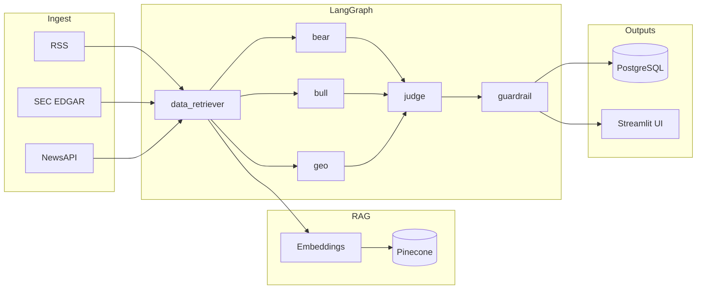

<div align="center">

# Supply Chain Risk Monitor

**Multi-agent LangGraph pipeline that ingests news, filings, and feeds — then debates risk from bear, bull, and geopolitical angles before a structured verdict.**

[](https://www.python.org/)
[](https://streamlit.io/)
[](https://github.com/langchain-ai/langgraph)
[](https://cloud.google.com/run)

[Features](#-features) · [Architecture](#-architecture) · [Quick start](#-quick-start) · [Deploy](#-deployment)

</div>

---

## Features

| | |
| --- | --- |
| **Six-agent pipeline** | Retrieve → parallel analysts (bear · bull · geopolitical) → judge → guardrail |
| **RAG** | Pinecone + OpenAI `text-embedding-3-small` over curated document chunks |
| **Data sources** | RSS (curated feeds), SEC EDGAR, NewsAPI |
| **Structured output** | Judge returns JSON with **risk score 0–100**; guardrail adds trust / hallucination signals |
| **UI** | Streamlit app — **Search**, **Results**, **GuardRail** |
| **Persistence** | PostgreSQL (Cloud SQL or local Docker) · optional GCS for raw artifacts |
| **Ship it** | Docker · GitHub Actions → GCR → Cloud Run |

---

## Architecture



**Pipeline order:** `data_retriever` → `analysts` (three parallel LLM calls) → `judge` → `guardrail` → end.

---

## Quick start

### 1. Clone & environment

```bash
git clone https://github.com/HrishiPal21/supply-chain-risk-monitor.git
cd supply-chain-risk-monitor
cp .env.example .env
```

Fill **at minimum** in `.env`:

- `OPENAI_API_KEY`
- `PINECONE_API_KEY` · `PINECONE_INDEX_NAME` · `PINECONE_ENVIRONMENT`
- `NEWS_API_KEY`

For GCP features locally, set `GOOGLE_APPLICATION_CREDENTIALS` to your service account JSON path (see `.env.example`).

### 2. Python (venv)

```bash
python -m venv .venv
source .venv/bin/activate   # Windows: .venv\Scripts\activate
pip install -r requirements.txt
streamlit run app.py
```

Open the app at `http://localhost:8501` (Streamlit default). Use Docker Compose below if you prefer Postgres in containers.

### 3. Docker Compose (app + Postgres)

```bash
docker compose up --build
```

Open **`http://localhost:8080`** — the container binds Streamlit to `PORT` (see `Dockerfile`).
- Postgres **`16`** loads `db/schema.sql` on first init.

---

## Deployment

Pushes to **`main`** trigger [`.github/workflows/deploy.yml`](.github/workflows/deploy.yml):

1. Build Docker image → **Google Container Registry**
2. Deploy to **Cloud Run** (`us-central1`, service `supply-chain-risk`) with Cloud SQL attachment and secrets as env vars

Required GitHub **Actions secrets** (non-exhaustive — see workflow file): `GCP_SA_KEY`, `GCP_PROJECT_ID`, `CLOUD_SQL_CONNECTION_NAME`, API keys, DB credentials, `GCS_BUCKET_NAME`, Pinecone index name, etc.

---

## Project layout

```
supply-chain-risk-monitor/
├── app.py                 # Streamlit entry
├── pages/                 # Multi-page UI (Search, Results, GuardRail)
├── agents/
│   ├── graph.py           # Compiled LangGraph + run_pipeline()
│   ├── state.py
│   └── nodes/             # Retriever, analysts, judge, guardrail
├── tools/                 # RSS, EDGAR, News, Pinecone, Postgres, GCS
├── db/schema.sql
├── Dockerfile
├── docker-compose.yml
└── .github/workflows/deploy.yml
```

---

## Roadmap / notes

Token limits on very long EDGAR filings, RSS URL validation, and OpenAI retry logic are called out in [`PROJECT_LOG.md`](PROJECT_LOG.md).

---

<div align="center">

**Built with LangGraph · GPT-4o · Pinecone · GCP**

</div>
