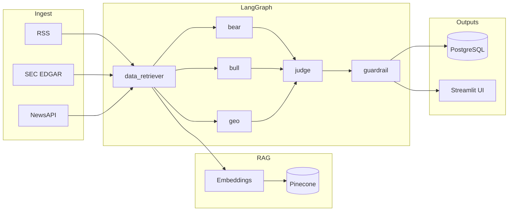

<div align="center">

# Supply Chain Risk Monitor

**Multi-agent LangGraph pipeline that ingests news, filings, and feeds — then debates risk from bear, bull, and geopolitical angles before a structured verdict.**

[](https://www.python.org/)
[](https://streamlit.io/)
[](https://github.com/langchain-ai/langgraph)
[](https://cloud.google.com/run)
[](LICENSE)

[Features](#features) · [Status](#project-status) · [Architecture](#architecture) · [Quick start](#quick-start) · [Deploy](#deployment) · [Security](#security--secrets) · [License](#license)

</div>

---

## Project status

### Day 1 — shipped

End-to-end **scaffold**: every module is wired and importable (no stub-only paths).

| Area | What exists today |
| --- | --- |
| **LLM & orchestration** | GPT-4o · LangGraph graph with `data_retriever` → parallel **bear / bull / geopolitical** analysts → **judge** → **guardrail** · `run_pipeline()` in [`agents/graph.py`](agents/graph.py) |
| **RAG & memory** | Pinecone + OpenAI `text-embedding-3-small` · cached index client ([`tools/pinecone_client.py`](tools/pinecone_client.py)) |
| **Data layer** | RSS (curated feeds), SEC EDGAR, NewsAPI · deduped retrieval in [`agents/nodes/data_retriever.py`](agents/nodes/data_retriever.py) |
| **Persistence** | PostgreSQL schema ([`db/schema.sql`](db/schema.sql)) · Cloud SQL–compatible client ([`tools/postgres_db.py`](tools/postgres_db.py)) · GCS helper ([`tools/gcs_client.py`](tools/gcs_client.py)) |
| **UI** | Streamlit · [`pages/1_Search.py`](pages/1_Search.py), [`pages/2_Results.py`](pages/2_Results.py), [`pages/3_GuardRail.py`](pages/3_GuardRail.py) · [`config.py`](config.py) for env |
| **Ops** | [`Dockerfile`](Dockerfile) (Cloud Run–style `PORT`) · [`docker-compose.yml`](docker-compose.yml) (app + Postgres 16 + schema on init) · [`.github/workflows/deploy.yml`](.github/workflows/deploy.yml) → GCR → Cloud Run |

Detailed file-by-file notes and bugfix history live in [`PROJECT_LOG.md`](PROJECT_LOG.md).

### Day 2 — next up

**Priority 1 — runnable locally**

- [ ] Copy [`.env.example`](.env.example) → `.env` and set `OPENAI_API_KEY`, `PINECONE_*`, `NEWS_API_KEY`
- [ ] `docker compose up` — Postgres up, schema applies cleanly
- [ ] `pip install -r requirements.txt` in a venv — no import errors
- [ ] One end-to-end query from **Search** via `streamlit run app.py`

**Priority 2 — validate the LangGraph pipeline**

- [ ] Smoke test `run_pipeline("semiconductor supply from Taiwan")` in a Python shell
- [ ] Confirm all three analyst outputs are non-`None` before the judge runs
- [ ] Confirm judge JSON includes integer `risk_score`
- [ ] Confirm `guardrail_report` persists to Postgres as structured data (dict), not an opaque string

**Priority 3 — GCP foundation (ahead of production deploy)**

- [ ] GCP project + APIs: Cloud Run, Cloud SQL, GCS, Secret Manager
- [ ] Cloud SQL Postgres 16 + connection name
- [ ] GCS bucket (e.g. `supply-chain-risk-raw`)
- [ ] Service account (Cloud SQL Client, Storage Object Admin) → `secrets/gcp_service_account.json` (gitignored)
- [ ] GitHub Actions secrets: `GCP_SA_KEY`, `GCP_PROJECT_ID`, `CLOUD_SQL_CONNECTION_NAME`, DB + API secrets

**Known gaps queued after Day 2 validation**

| Gap | Notes |
| --- | --- |
| Context length | No hard token guard before GPT-4o — very long EDGAR filings may overflow context |
| RSS | Feed URLs need live validation; some sources (e.g. FT) may require a subscription |
| Resilience | No OpenAI retry/backoff yet — rate limits will show up under load |
| Results UI cache | [`pages/2_Results.py`](pages/2_Results.py) cached reads — new runs may need refresh or TTL UX |

---

## Features

| | |
| --- | --- |
| **Six-agent pipeline** | Retrieve → parallel analysts (bear · bull · geopolitical) → judge → guardrail |
| **RAG** | Pinecone + OpenAI `text-embedding-3-small` over curated document chunks |
| **Data sources** | RSS (curated feeds), SEC EDGAR, NewsAPI |
| **Structured output** | Judge returns JSON with **risk score 0–100**; guardrail adds trust / hallucination signals |
| **UI** | Streamlit app — **Search**, **Results**, **GuardRail** |
| **Persistence** | PostgreSQL (Cloud SQL or local Docker) · optional GCS for raw artifacts |
| **Ship it** | Docker · GitHub Actions → GCR → Cloud Run |

---

## Architecture



**Pipeline order:** `data_retriever` → `analysts` (three parallel LLM calls) → `judge` → `guardrail` → end.

---

## Quick start

### 1. Clone & environment

```bash
git clone https://github.com/HrishiPal21/supply-chain-risk-monitor.git
cd supply-chain-risk-monitor
cp .env.example .env
```

Fill **at minimum** in `.env`:

- `OPENAI_API_KEY`
- `PINECONE_API_KEY` · `PINECONE_INDEX_NAME` · `PINECONE_ENVIRONMENT`
- `NEWS_API_KEY`

For GCP features locally, set `GOOGLE_APPLICATION_CREDENTIALS` to your service account JSON path (see `.env.example`).

### 2. Python (venv)

```bash
python -m venv .venv
source .venv/bin/activate   # Windows: .venv\Scripts\activate
pip install -r requirements.txt
streamlit run app.py
```

Open the app at `http://localhost:8501` (Streamlit default). Use Docker Compose below if you prefer Postgres in containers.

### 3. Docker Compose (app + Postgres)

```bash
docker compose up --build
```

Open **`http://localhost:8080`** — the container binds Streamlit to `PORT` (see `Dockerfile`).
- Postgres **`16`** loads `db/schema.sql` on first init.

---

## Deployment

Pushes to **`main`** trigger [`.github/workflows/deploy.yml`](.github/workflows/deploy.yml):

1. Build Docker image → **Google Container Registry**
2. Deploy to **Cloud Run** (`us-central1`, service `supply-chain-risk`) with Cloud SQL attachment and secrets as env vars

Required GitHub **Actions secrets** (non-exhaustive — see workflow file): `GCP_SA_KEY`, `GCP_PROJECT_ID`, `CLOUD_SQL_CONNECTION_NAME`, API keys, DB credentials, `GCS_BUCKET_NAME`, Pinecone index name, etc.

---

## Project layout

```
supply-chain-risk-monitor/
├── app.py                 # Streamlit entry
├── pages/                 # Multi-page UI (Search, Results, GuardRail)
├── agents/
│   ├── graph.py           # Compiled LangGraph + run_pipeline()
│   ├── state.py
│   └── nodes/             # Retriever, analysts, judge, guardrail
├── tools/                 # RSS, EDGAR, News, Pinecone, Postgres, GCS
├── db/schema.sql
├── Dockerfile
├── docker-compose.yml
└── .github/workflows/deploy.yml
```

---

## Security & secrets

| Check | Status |
| --- | --- |
| `.env` tracked | No — `.env` is gitignored |
| `secrets/` (e.g. GCP JSON keys) tracked | No — directory gitignored |
| Real API keys in source | None found; `.env.example` uses placeholders only (`sk-...`, `...`) |
| CI/CD | Workflow uses `${{ secrets.* }}`; values live in **GitHub → Settings → Secrets and variables → Actions** |

`docker-compose.yml` uses `POSTGRES_PASSWORD=postgres` **for local development only**. Use strong credentials for any shared or production database.

---

## License

Released under the [MIT License](LICENSE).

---

<div align="center">

**Built with LangGraph · GPT-4o · Pinecone · GCP**

</div>
