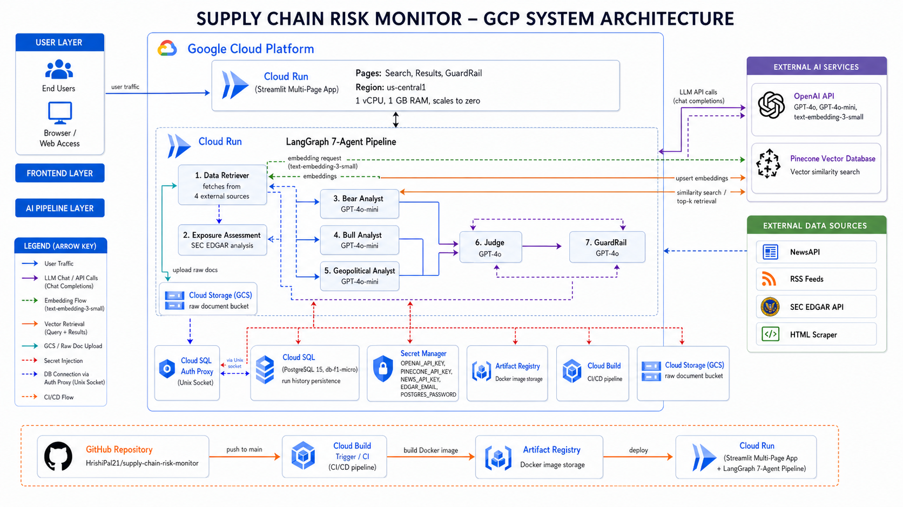
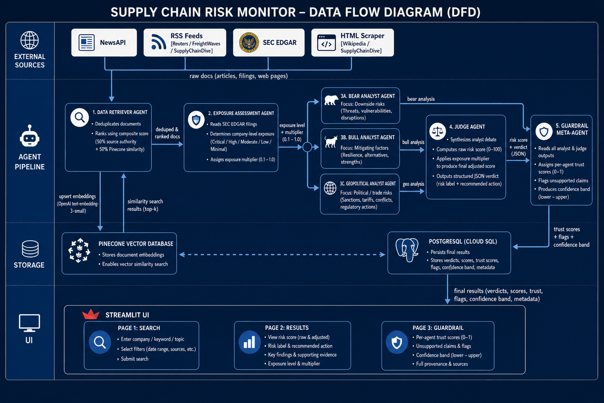
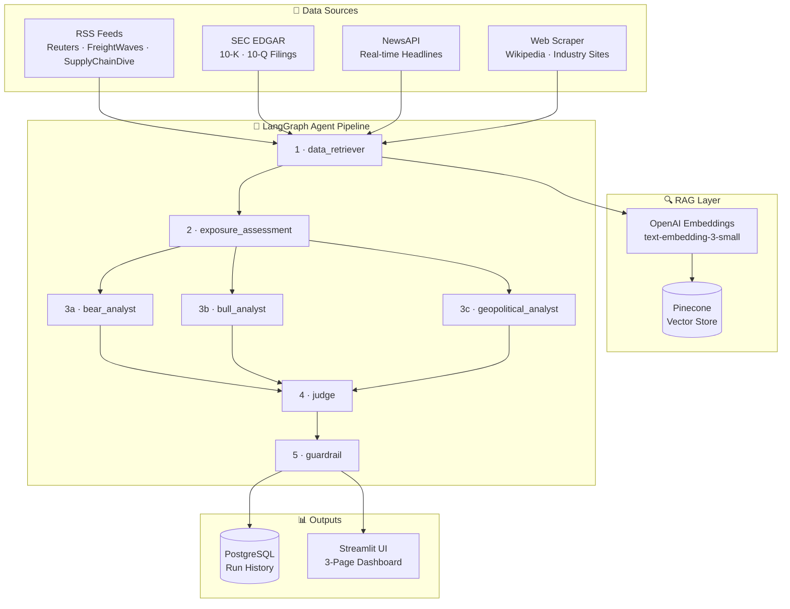

<div align="center">

<br>

# 🔗 Supply Chain Risk Monitor

### An agentic AI system that ingests real-time news, SEC filings, and web intelligence —<br>then delivers a structured, scored risk verdict through a multi-agent debate pipeline.

<br>

[](https://www.python.org/)
[](https://streamlit.io/)
[](https://github.com/langchain-ai/langgraph)
[](https://openai.com/)
[](https://www.pinecone.io/)
[](https://cloud.google.com/run)
[](LICENSE)

<br>

### 🌐 [Live Application →](https://supply-chain-risk-211330169092.us-central1.run.app)

<br>

[Overview](#-overview) · [Architecture](#-architecture) · [Pipeline](#-pipeline) · [Quick Start](#-quick-start) · [Deployment](#-deployment) · [Evaluation](#-evaluation) · [Limitations](#-limitations) · [Security](#-security)

<br>

</div>

---

## 🧭 Overview

**Supply Chain Risk Monitor** is a production-grade, multi-agent AI application that automates supply chain risk intelligence. Given a risk scenario and an optional company ticker, the system:

> 📡 **Retrieves** real-time intelligence from four data sources — NewsAPI, RSS feeds, SEC EDGAR, and web scrapers
>
> 🏭 **Assesses** company-level exposure using SEC filings, assigning a multiplier from 1.0× (Critical) to 0.1× (Minimal)
>
> ⚔️ **Debates** the risk through three independent analyst agents — bear, bull, and geopolitical — running in parallel
>
> ⚖️ **Synthesises** the debate into a final verdict and 0–100 risk score via a Judge agent
>
> 🛡️ **Validates** outputs for hallucinations and confidence through a GuardRail meta-agent

All of this runs in **under 45 seconds**, end-to-end, and surfaces through a polished three-page Streamlit dashboard.

---

## 🏗 Architecture

### System Architecture


### Data Flow


### Agent Pipeline



---

## 🤖 Pipeline

Each agent has a distinct, non-overlapping responsibility:

| # | Agent | Responsibility |
|---|-------|---------------|
| 1 | **Data Retriever** | Fetches and deduplicates documents from all four sources; chunks and upserts to Pinecone |
| 2 | **Exposure Assessment** | Reads retrieved docs (prioritising EDGAR) to assign an exposure level and numeric multiplier |
| 3a–c | **Bear · Bull · Geopolitical** | Three independent LLM calls running in parallel; each receives full retrieval context and exposure assessment |
| 4 | **Judge** | Synthesises the debate → `raw_score × exposure_multiplier = final_score`; derives risk label and action |
| 5 | **GuardRail** | Estimates per-agent trust scores; flags unsupported claims; assigns overall confidence band |

### 📊 Score Reference

| Score | Label | Recommended Action |
|-------|-------|--------------------|
| 0 – 20 | 🟢 Very Low | Watch |
| 21 – 40 | 🟡 Low | Watch |
| 41 – 60 | 🟠 Moderate | Monitor |
| 61 – 80 | 🔴 High | Escalate |
| 81 – 100 | 🚨 Critical | Immediate Action |

---

## 🛠 Tech Stack

| Layer | Technology |
|-------|-----------|
| Agent orchestration | LangGraph |
| LLM | OpenAI GPT-4o |
| Embeddings | OpenAI `text-embedding-3-small` |
| Vector store | Pinecone |
| Frontend | Streamlit |
| Database | PostgreSQL 15 (Cloud SQL / Docker) |
| Container runtime | Docker |
| CI/CD | Google Cloud Build |
| Hosting | Google Cloud Run |
| Secrets management | Google Secret Manager |

---

## 🚀 Quick Start

### Prerequisites

You will need API keys for the following services:

| Key | Source |
|-----|--------|
| `OPENAI_API_KEY` | [platform.openai.com](https://platform.openai.com) |
| `PINECONE_API_KEY` · `PINECONE_INDEX_NAME` · `PINECONE_ENVIRONMENT` | [app.pinecone.io](https://app.pinecone.io) |
| `NEWS_API_KEY` | [newsapi.org](https://newsapi.org) |

---

### Option A — Local (no Docker)

```bash
git clone https://github.com/HrishiPal21/supply-chain-risk-monitor.git
cd supply-chain-risk-monitor
cp .env.example .env          # fill in your API keys

python3 -m venv .venv
source .venv/bin/activate
pip install -r requirements.txt
streamlit run app.py --server.port 8502
```

Open **`http://localhost:8502`**. The app runs without PostgreSQL — run history is disabled but the full pipeline works.

---

### Option B — Docker Compose (app + PostgreSQL)

```bash
docker compose up --build
```

Open **`http://localhost:8080`**. PostgreSQL 16 initialises automatically from `db/schema.sql` on first start.

---

### ✅ Smoke Test

```bash
python3 smoke_test.py
```

Runs a full end-to-end pipeline query (semiconductor / Taiwan / no ticker) and asserts 20+ fields for correctness. Exits `0` on pass.

---

## 📁 Project Layout

```
supply-chain-risk-monitor/
├── app.py                          # Streamlit entry point
├── config.py                       # Environment variables, OpenAI client factory
├── smoke_test.py                   # End-to-end integration test
│
├── pages/
│   ├── 1_Search.py                 # Quick Scenarios · Guided Builder · Custom Query
│   ├── 2_Results.py                # Score banner · verdict · analyst tabs · sources
│   └── 3_GuardRail.py              # Trust scores · hallucination flags · confidence band
│
├── agents/
│   ├── graph.py                    # LangGraph wiring and run_pipeline()
│   ├── state.py                    # AgentState TypedDict
│   └── nodes/
│       ├── data_retriever.py
│       ├── exposure_assessment.py
│       ├── bear_analyst.py
│       ├── bull_analyst.py
│       ├── geopolitical_analyst.py
│       ├── judge.py
│       └── guardrail.py
│
├── tools/
│   ├── news.py                     # NewsAPI integration
│   ├── rss_feed.py                 # RSS (Reuters, FreightWaves, SupplyChainDive)
│   ├── edgar.py                    # SEC EDGAR full-text search and filing fetch
│   ├── html_scraper.py             # BeautifulSoup scraper (Wikipedia, industry sites)
│   ├── pinecone_client.py          # Pinecone index client (cached singleton)
│   ├── postgres_db.py              # DB helpers — graceful degradation when offline
│   ├── gcs_client.py               # GCS raw artifact upload (optional)
│   └── retry.py                    # Exponential backoff for OpenAI calls
│
├── db/schema.sql                   # PostgreSQL schema
├── assets/                         # Architecture diagrams
├── Dockerfile
├── docker-compose.yml
└── cloudbuild.yaml                 # Cloud Build CI/CD pipeline
```

---

## ☁️ Deployment

**Live URL:** https://supply-chain-risk-211330169092.us-central1.run.app

Every push to `main` triggers the Cloud Build pipeline defined in `cloudbuild.yaml`:

1. Build Docker image → push to **Artifact Registry** (`us-central1`)
2. Deploy to **Cloud Run** with Cloud SQL attachment and secrets injected from Secret Manager

### Infrastructure

| Component | Service | Notes |
|-----------|---------|-------|
| Application runtime | Cloud Run | Serverless; scales to zero when idle |
| Database | Cloud SQL — PostgreSQL 15 (`db-f1-micro`) | Run history persistence |
| API key management | Secret Manager | All keys injected at runtime; none baked into the image |
| CI/CD | Cloud Build | Triggered automatically on push to `main` |

To deploy manually:
```bash
bash deploy.sh
```

---

## 📈 Evaluation

### Test Coverage

| Scenario | Method | Outcome |
|----------|--------|---------|
| Full pipeline — semiconductor / Taiwan, no ticker | `smoke_test.py` (20+ assertions) | ✅ All checks pass |
| Exposure Assessment — `AAPL` | Manual run | ✅ **Critical (1.0×)** — EDGAR confirms heavy TSMC / Taiwan dependency |
| Exposure Assessment — `MCD` | Manual run | ✅ **Minimal (0.1×)** — McDonald's has no semiconductor supply chain |
| Partial context (induced source failure) | Forced source failure | ✅ `partial_context=True` flag propagates to UI; pipeline completes |
| HTML scraper | Manual run | ✅ Wikipedia · SupplyChainDive · LogisticsMgmt |
| DB offline | Run without Docker | ✅ Full pipeline runs; history features disabled gracefully |

### Output Quality

- **The exposure multiplier differentiates scores meaningfully.** AAPL (Critical, 1.0×) receives its full raw score for a Taiwan semiconductor query. MCD (Minimal, 0.1×) receives 10% of the same raw score — consistent with real-world supply chain exposure.
- **Judge synthesis is non-trivial.** The bear/bull debate rarely converges, ensuring the judge performs genuine synthesis rather than averaging positions.
- **Source diversity influences output.** Runs with only NewsAPI score measurably differently from runs that include EDGAR filings, confirming RAG retrieval actively shapes the analysis.
- **GuardRail scores are calibration signals, not ground truth.** Trust scores are LLM-estimated by reading agent outputs, not by independent fact verification.

### Observed Score Range

| Query Type | Raw Score | Exposure-Adjusted (AAPL) | Exposure-Adjusted (MCD) |
|------------|-----------|--------------------------|--------------------------|
| Taiwan semiconductor / Red Sea | 65–85 | 65–85 (1.0×) | 7–9 (0.1×) |

---

## ⚠️ Limitations

**GuardRail is self-referential.**
The guardrail agent estimates trust by reading the other agents' outputs, not by verifying claims against external sources. True hallucination detection would require an independent fact-checking layer.

**No streaming output.**
The pipeline runs synchronously. The UI displays a progress indicator until the full result is ready (typically 20–45 seconds depending on source availability).

**EDGAR coverage is uneven.**
Exposure assessment performs well for large-cap companies with detailed 10-K risk factor sections, but returns `Unknown` for smaller companies with limited filing history.

**Source availability degrades retrieval quality.**
NewsAPI, RSS feeds, and HTML scrapers each have failure modes (rate limits, paywalls, DNS timeouts). The `partial_context` flag surfaces this in the UI, but low-retrieval runs produce lower-confidence outputs.

**Parallel branch state discipline.**
LangGraph parallel branches write to disjoint keys in `AgentState`. Any future state schema changes must preserve this separation to avoid silent key collisions.

---

## 🔒 Security

| Control | Status |
|---------|--------|
| `.env` committed to version control | ❌ Gitignored |
| API keys in source code | ❌ None — `.env.example` uses placeholder values only |
| Production secrets | ✅ Stored in Google Secret Manager; injected at runtime |
| Local dev database password | ⚠️ `postgres` (Docker Compose only — not used in production) |

---

## 📄 License

Released under the [MIT License](LICENSE).
